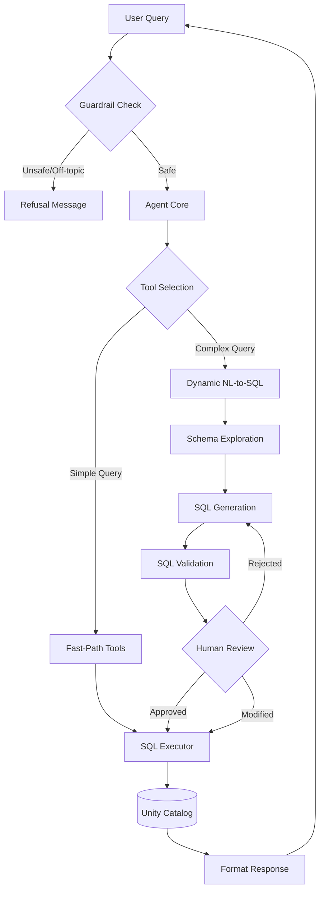
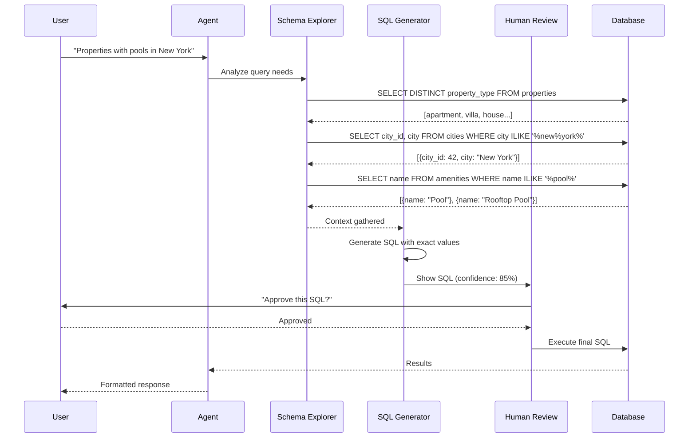
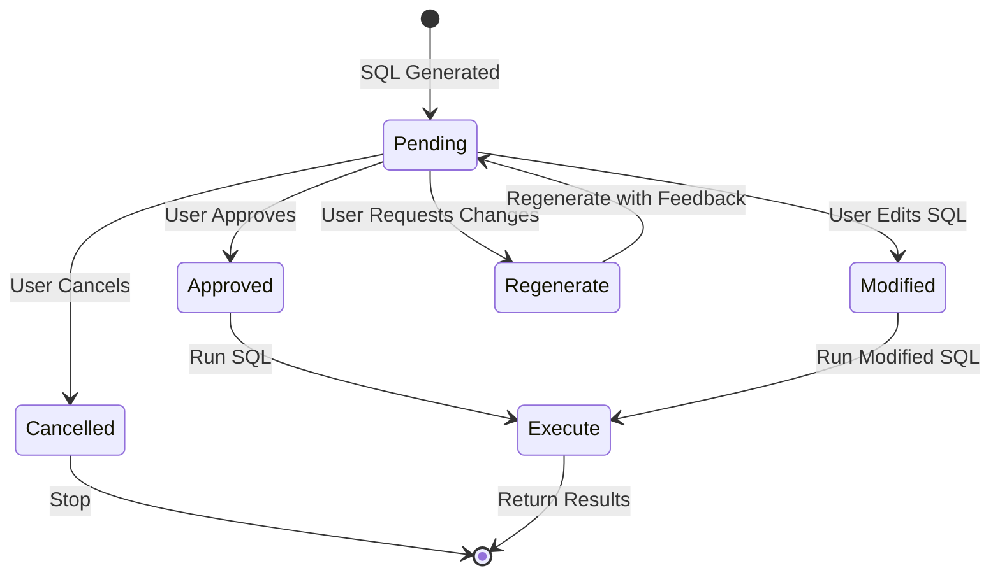

# Wanderbricks Agent Architecture

## Overview
The Wanderbricks agent is designed as a **Tool-Calling (ReAct) Agent** with an enhanced **Dynamic NL-to-SQL Layer**. This architecture allows the Large Language Model (LLM) to "reason" about a user's intent and structurally "act" by invoking specialized tools that interact with the Databricks Unity Catalog.

## High-Level Architecture



## Core Components

### 1. The Brain (LLM)
*   **Role**: Reasoning engine and SQL generation.
*   **Implementation**: Databricks Model Serving (e.g., DBRX or Llama 3).
*   **Function**: Parses natural language, selects tools, extracts parameters, and generates dynamic SQL when needed.

### 2. The Orchestrator
*   **Role**: Control flow management.
*   **Implementation**: **LangChain** with optional **LangGraph** for stateful workflows.
*   **Function**: Manages the ReAct loop and human review state machine.

### 3. The Tools (Action Layer)

#### Fast-Path Tools (Fixed SQL Templates)
| Tool | Purpose | SQL Pattern |
|------|---------|-------------|
| `search_properties` | Property search | `SELECT * FROM properties WHERE...` |
| `get_amenities` | Property amenities | `JOIN property_amenities, amenities` |
| `book_property` | Create booking | `INSERT INTO bookings` |

#### Dynamic Tools (Schema-Aware Generation)
| Tool | Purpose | Capability |
|------|---------|------------|
| `smart_query` | Multi-step NL-to-SQL | Runs exploration queries first |
| `natural_language_query` | Direct NL-to-SQL | Single-step generation |
| `explore_column_values` | Schema exploration | Discover valid values |
| `get_table_schema` | Schema info | View table structure |

### 4. Safety Layer (Guardrails)
*   **Role**: Pre-emptive filtering.
*   **Implementation**: Custom `TravelTopicGuardrail` class.
*   **Function**: Blocks off-topic and malicious queries before LLM processing.

### 5. Human Review Node
*   **Role**: SQL approval workflow.
*   **Implementation**: `HumanReviewNode` class.
*   **Function**: Shows generated SQL to user for approval/modification before execution.

### 6. Observability
*   **Role**: Monitoring and Debugging.
*   **Implementation**: **MLflow Tracing**.
*   **Function**: Logs all steps including exploration queries, SQL generation, and review decisions.

---

## Deep Dive: Dynamic NL-to-SQL

The agent now supports **two modes** of NL-to-SQL:

### Mode 1: Fast-Path (Parameter Extraction)
For common queries with known patterns:

```
User: "Find apartments in Miami under $300"
     ↓
Tool: search_properties(location="Miami", max_price=300, property_type="apartment")
     ↓
SQL: SELECT * FROM properties p JOIN cities c ON... WHERE c.city ILIKE '%Miami%'
```

### Mode 2: Multi-Step Dynamic Generation
For complex queries requiring context exploration:



---

## Multi-Step Query Workflow

### Step 1: Query Analysis
The system identifies what context is needed:
- Property types to validate
- City names to resolve
- Amenity names to match
- Price ranges to check

### Step 2: Schema Exploration
Runs intermediate SQL queries:
```sql
-- Validate property types
SELECT DISTINCT property_type FROM wanderbricks.properties

-- Find matching city
SELECT city_id, city FROM wanderbricks.cities WHERE city ILIKE '%new%york%'

-- Find matching amenities  
SELECT amenity_id, name FROM wanderbricks.amenities WHERE name ILIKE '%pool%'
```

### Step 3: Context-Aware Generation
Uses exploration results to generate accurate SQL:
```sql
SELECT p.*, c.city, a.name as amenity
FROM wanderbricks.properties p
JOIN wanderbricks.cities c ON p.city_id = c.city_id
JOIN wanderbricks.property_amenities pa ON p.property_id = pa.property_id
JOIN wanderbricks.amenities a ON pa.amenity_id = a.amenity_id
WHERE c.city_id = 42  -- Exact ID from exploration
  AND a.amenity_id IN (5, 12)  -- Pool amenity IDs from exploration
LIMIT 100
```

### Step 4: Human Review
User can approve, modify, or reject before execution.

---

## Human Review Workflow



### Review Triggers
| Condition | Review Required |
|-----------|-----------------|
| Confidence < 95% | Yes |
| Confidence ≥ 95% | Skipped (auto-approve) |
| User requests | Always |

---

## SQL Safety Validations

All generated SQL is validated:

| Check | Action |
|-------|--------|
| `DROP`, `TRUNCATE`, `ALTER` | **Blocked** |
| `DELETE` without WHERE | **Blocked** |
| `UPDATE` without WHERE | **Blocked** |
| Non-wanderbricks schema | **Blocked** |
| Missing LIMIT on SELECT | Auto-add `LIMIT 100` |

---

## File Structure

```
wanderbricks/
├── agent_core.py          # Main agent with review workflow
├── tools.py               # All tool definitions
├── sql_generator.py       # Schema-aware SQL generation
├── multi_step_sql.py      # Multi-step query workflow
├── human_review.py        # Human review node
├── guardrails.py          # Safety checks
├── DATA_SCHEMAS.md        # Table schema documentation
├── DATA_MODEL_ERD.md      # Entity relationship diagram
└── NL_TO_SQL_WORKFLOW.md  # Workflow documentation
```

---

## Design Justification (Interview Talking Points)

*   **Why Multi-Step?**: Ensures generated SQL uses correct column values by exploring the schema first.
*   **Why Human Review?**: Enterprise-grade safety - users approve SQL before it runs.
*   **Why Fast-Path + Dynamic?**: Fast-path for common queries (speed), dynamic for edge cases (flexibility).
*   **Why Schema Context?**: LLM knows exact table structures, relationships, and valid values.

