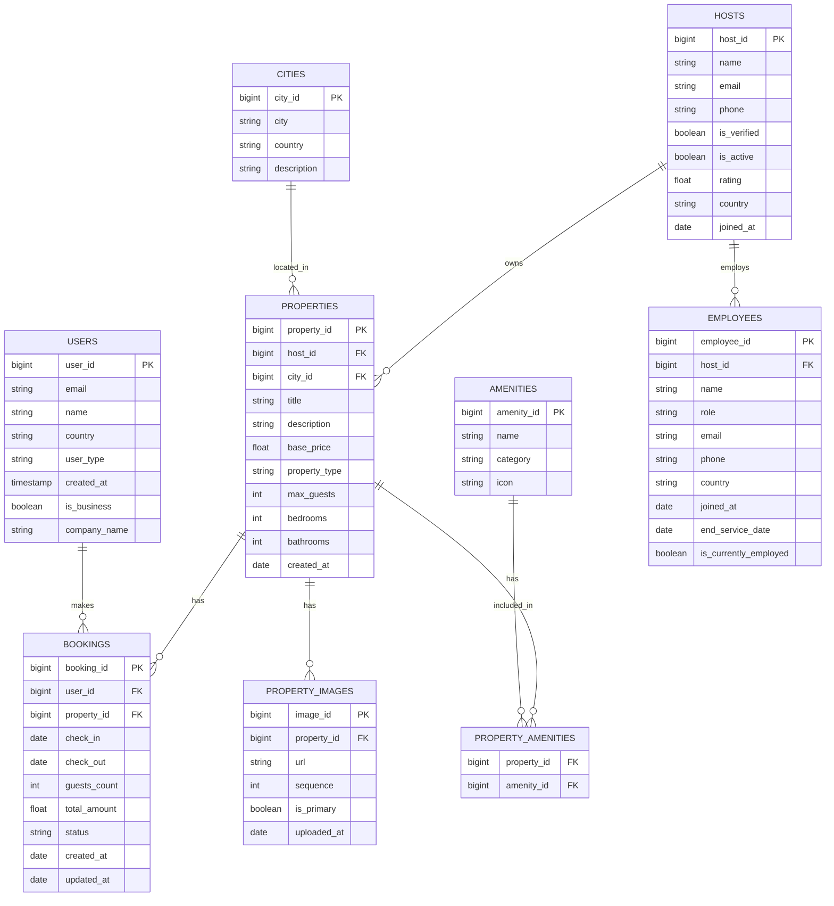
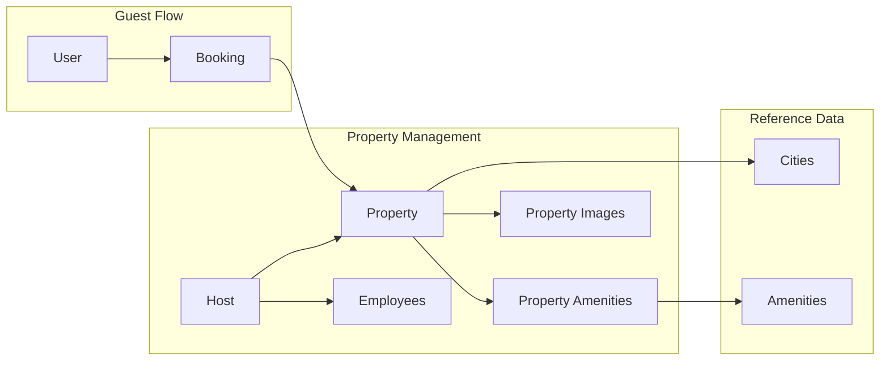

# Wanderbricks Data Model - Entity Relationship Diagram

This document provides a visual representation of the Wanderbricks database schema and table relationships.

## Complete Entity Relationship Diagram



---

## Relationship Summary

### One-to-Many Relationships

| Parent Table | Child Table | Relationship | Foreign Key |
|--------------|-------------|--------------|-------------|
| `hosts` | `properties` | A host can own many properties | `properties.host_id` |
| `cities` | `properties` | A city can have many properties | `properties.city_id` |
| `properties` | `bookings` | A property can have many bookings | `bookings.property_id` |
| `users` | `bookings` | A user can make many bookings | `bookings.user_id` |
| `properties` | `property_images` | A property can have many images | `property_images.property_id` |
| `hosts` | `employees` | A host can have many employees | `employees.host_id` |

### Many-to-Many Relationships

| Table 1 | Table 2 | Junction Table | Description |
|---------|---------|----------------|-------------|
| `properties` | `amenities` | `property_amenities` | Properties have multiple amenities; amenities belong to multiple properties |

---

## Common JOIN Patterns

### 1. Property Search with Location

```sql
-- Find properties in a specific city
SELECT p.*, c.city, c.country
FROM wanderbricks.properties p
JOIN wanderbricks.cities c ON p.city_id = c.city_id
WHERE c.city ILIKE '%Paris%'
```

### 2. Property with Host Details

```sql
-- Get property with host information
SELECT p.title, p.base_price, h.name as host_name, h.rating as host_rating
FROM wanderbricks.properties p
JOIN wanderbricks.hosts h ON p.host_id = h.host_id
WHERE h.is_verified = true
```

### 3. Property with Amenities

```sql
-- Get all amenities for a property
SELECT p.title, a.name as amenity, a.category
FROM wanderbricks.properties p
JOIN wanderbricks.property_amenities pa ON p.property_id = pa.property_id
JOIN wanderbricks.amenities a ON pa.amenity_id = a.amenity_id
WHERE p.property_id = 123
```

### 4. Booking with Full Context

```sql
-- Get booking with property and user details
SELECT 
    b.booking_id,
    b.check_in,
    b.check_out,
    b.total_amount,
    p.title as property_name,
    c.city,
    u.name as guest_name
FROM wanderbricks.bookings b
JOIN wanderbricks.properties p ON b.property_id = p.property_id
JOIN wanderbricks.cities c ON p.city_id = c.city_id
JOIN wanderbricks.users u ON b.user_id = u.user_id
WHERE b.status = 'confirmed'
```

### 5. Host Revenue Analysis

```sql
-- Calculate total revenue per host
SELECT 
    h.name as host_name,
    COUNT(DISTINCT p.property_id) as property_count,
    SUM(b.total_amount) as total_revenue
FROM wanderbricks.hosts h
JOIN wanderbricks.properties p ON h.host_id = p.host_id
JOIN wanderbricks.bookings b ON p.property_id = b.property_id
WHERE b.status = 'confirmed'
GROUP BY h.host_id, h.name
ORDER BY total_revenue DESC
```

---

## Data Flow Diagram



---

## Query Complexity Guide

| Complexity | Tables Involved | Example Use Case |
|------------|-----------------|------------------|
| **Simple** | 1 table | Get property by ID |
| **Basic Join** | 2 tables | Properties with city names |
| **Multi-Join** | 3+ tables | Property with host, city, and amenities |
| **Aggregation** | 2+ tables | Revenue by host, booking counts |
| **Subquery** | Multiple | Find properties with above-average ratings |

---

## Usage Notes for NL-to-SQL

When generating SQL from natural language:

1. **Location-based queries** → Always JOIN with `cities`
2. **Host-related queries** → JOIN with `hosts`
3. **Amenity filters** → Use `property_amenities` junction table
4. **Booking/Revenue queries** → Multi-table JOIN through `bookings`
5. **Image retrieval** → Use `is_primary` for featured images
