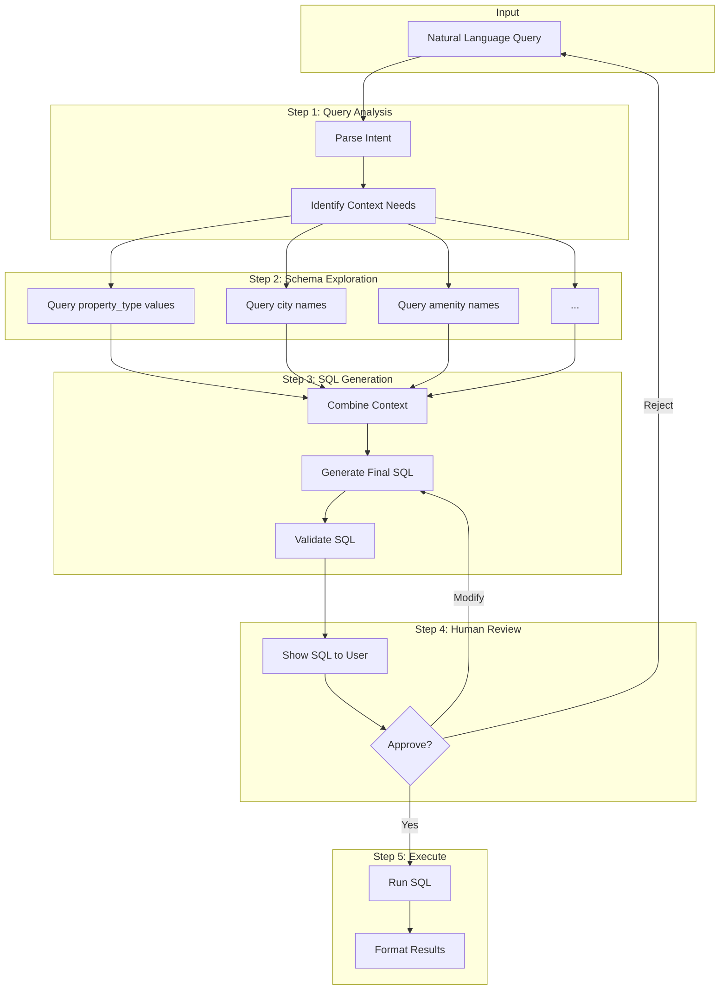
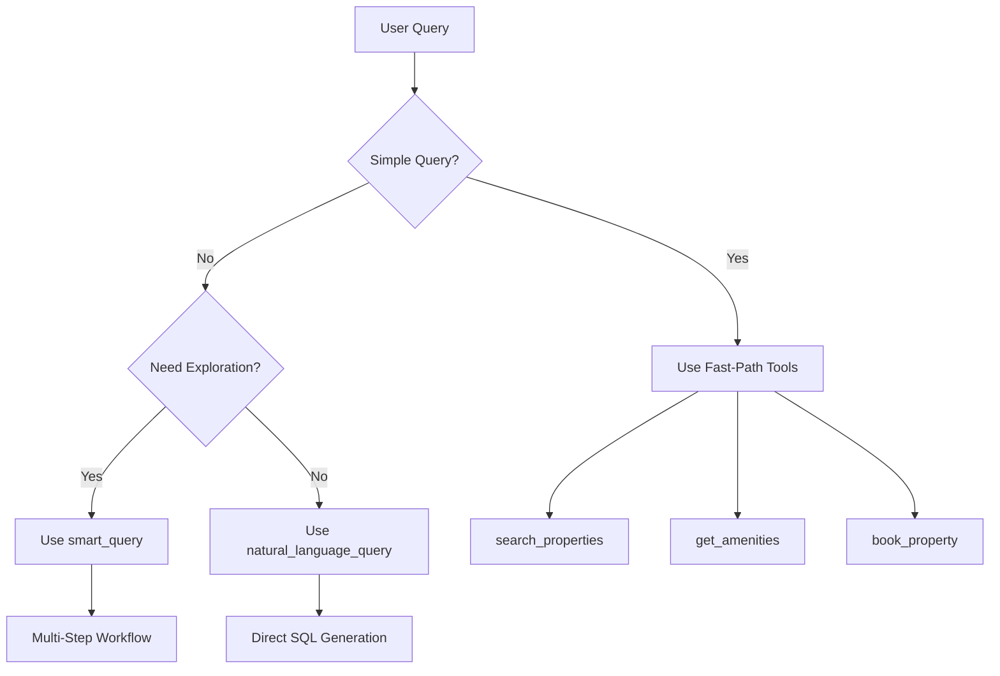
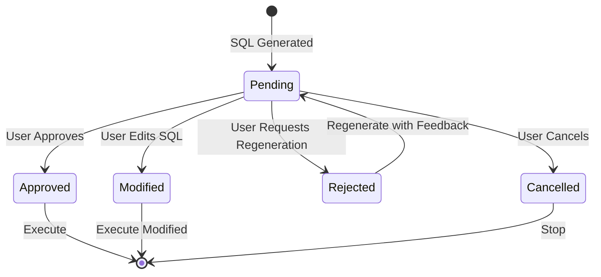
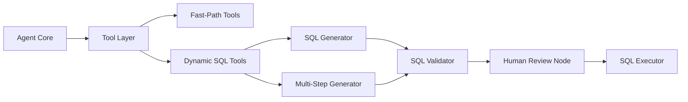

# NL-to-SQL Workflow Guide

This document explains how the Wanderbricks agent converts natural language queries into SQL using a multi-step, schema-aware approach.

## Overview

The NL-to-SQL layer uses **iterative query building**: instead of generating SQL directly, it first runs exploration queries to gather context (valid values, entity IDs) before constructing the final query.



---

## Example Workflow

### User Query
> "Looking for an apartment in New York for 2 nights under $200"

### Step 1: Query Analysis
The system identifies context needs:
- Need to validate "apartment" as a valid `property_type`
- Need to find "New York" in `cities` table and get `city_id`
- Need to understand price column (`base_price`)

### Step 2: Schema Exploration

```sql
-- Exploration Query 1: Validate property types
SELECT DISTINCT property_type FROM wanderbricks.properties LIMIT 20
-- Result: ['apartment', 'house', 'villa', 'cabin', 'condo']

-- Exploration Query 2: Find matching city
SELECT city_id, city FROM wanderbricks.cities WHERE city ILIKE '%new%york%' LIMIT 10
-- Result: [{'city_id': 42, 'city': 'New York'}]

-- Exploration Query 3: Check price range
SELECT MIN(base_price), MAX(base_price), AVG(base_price) FROM wanderbricks.properties
-- Result: [{'min': 50, 'max': 1500, 'avg': 280}]
```

### Step 3: SQL Generation (with context)

```sql
SELECT 
    p.property_id,
    p.title,
    p.base_price,
    p.property_type,
    p.bedrooms,
    c.city,
    c.country
FROM wanderbricks.properties p
JOIN wanderbricks.cities c ON p.city_id = c.city_id
WHERE p.property_type = 'apartment'  -- Exact match from exploration
  AND c.city_id = 42                  -- ID from exploration
  AND p.base_price <= 200
LIMIT 100
```

### Step 4: Human Review

```
━━━━━━━━━━━━━━━━━━━━━━━━━━━━━━━━━━━━━━━━━━
🔍 SQL REVIEW REQUEST
━━━━━━━━━━━━━━━━━━━━━━━━━━━━━━━━━━━━━━━━━━

📝 Your Query: "Looking for an apartment in New York for 2 nights under $200"

📊 Generated SQL: [shown above]

💡 Explanation: Search for apartments in New York City with price under $200/night

📈 Confidence: 85%

Choose: [1] ✅ APPROVE  [2] ✏️ MODIFY  [3] 🔄 REGENERATE  [4] ❌ CANCEL
━━━━━━━━━━━━━━━━━━━━━━━━━━━━━━━━━━━━━━━━━━
```

### Step 5: Execution
Query is executed and results returned to user.

---

## Available Tools

| Tool | Purpose | When to Use |
|------|---------|-------------|
| `smart_query` | Multi-step NL-to-SQL with exploration | Complex queries needing context |
| `natural_language_query` | Direct NL-to-SQL | Simple, unambiguous queries |
| `explore_column_values` | Discover valid column values | Before constructing filters |
| `get_table_schema` | View table structure | Understanding data model |
| `search_properties` | Fast property search | Simple location/price search |
| `get_amenities` | Get property amenities | After finding property ID |
| `book_property` | Create booking | Completing a reservation |

---

## Tool Selection Logic



---

## Human Review Workflow

### Review States



### When Review is Triggered

- **Automatic Review**: Confidence < 95%
- **Skipped**: Confidence ≥ 95% (configurable)
- **Forced**: User explicitly requests review

---

## SQL Safety Validations

All generated SQL is validated before execution:

| Check | Blocked Patterns |
|-------|------------------|
| No destructive ops | `DROP`, `TRUNCATE`, `ALTER` |
| No blind modifications | `DELETE` without WHERE |
| Schema restriction | Only `wanderbricks.*` tables |
| Result limiting | Auto-adds `LIMIT 100` |

---

## Code Examples

### Using smart_query in Python

```python
from wanderbricks.tools import smart_query

# Multi-step query with exploration
result = smart_query("properties with pools in Miami under $300")
print(result)
```

### Using exploration before custom query

```python
from wanderbricks.tools import explore_column_values

# First, explore valid property types
types = explore_column_values("properties", "property_type")
print(f"Valid types: {types}")

# Then explore cities
cities = explore_column_values("cities", "city", "miami")
print(f"Matching cities: {cities}")
```

### Disabling human review

```python
from wanderbricks.tools import set_human_review_enabled

# Disable for automated pipelines
set_human_review_enabled(False)
```

---

## Architecture Integration

This workflow integrates with the main agent architecture as follows:


